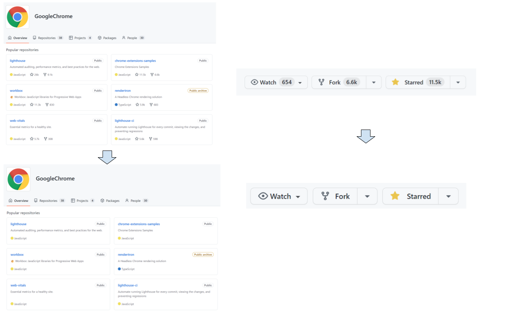

# Eyes away from GitHub popularity

A Chrome Extension to hide stars, followers and watchers in GitHub

## Why?

I don't want my heart to be disturbed by the "±", especially during coding and research.

## Install

### Chrome Web Store

Request has been submitted ☕

### From local

[Load this folder as an unpacked extension](https://developer.chrome.com/docs/extensions/mv3/getstarted/development-basics/#load-unpacked)

## Covered features

- User
- Repository index
- Repository detail
- Pinned Repositories
- Explore repositories

## Limitations

Currently avoiding the use of JavaScript.\
So the following feature cannot be suppressed because GitHub does not provide a selectable attribute.

- Sponsors

## Inspired

While digging into this feature, I noticed that [rentzsch/unpopular](https://github.com/rentzsch/unpopular/tree/863963e26c1a758a53eb33747e0fec6f26ac130d) exists.\
The way looks simple and reasonable to me, it just apply CSS without any JavaScript.\
However, I started this project from below reasons.

- Applying CSS doesn't work with the current GitHub WebUI
- There is no activity in these 8 years
- It uses manifest version2. [Google will disable it with version3](https://developer.chrome.com/docs/extensions/mv3/mv2-sunset/).
- I want to focus on GitHub, would not consider around Twitter
