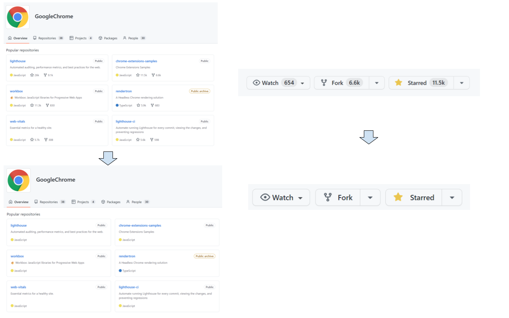
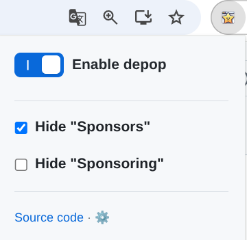

# depop

A browser extension for Chrome and Firefox to hide stars, followers, watchers, sponsors, and other stats on GitHub

## Why?

I don't want my heart to be disturbed by the "±", especially during coding and research.

## Installation

Choose one of the following options.

- Visit [Chrome Web Store](https://chromewebstore.google.com/detail/depop/bblbchjekobacogfioehogggccfagkmk)
- Download the browser-specific zip archive from the [release page](https://github.com/kachick/depop/releases) (e.g., `depop-x.x.x-chrome.zip` or `depop-x.x.x-firefox.zip`) and load it:
  - Chrome: `chrome://extensions/`
  - Firefox: `about:debugging` -> "This Firefox" -> "Load Temporary Add-on"
- Download the unstable zip archive from the [uploaded artifacts](https://github.com/kachick/depop/actions/workflows/ci.yml?query=branch%3Amain+is%3Asuccess). Use it in the same way as stable.
- [Run the build task](CONTRIBUTING.md) and load the "./dist" folder as an [unpacked extension](https://developer.chrome.com/docs/extensions/mv3/getstarted/development-basics/#load-unpacked)

## Usage

By default, stars are hidden as much as possible.
You can enable/disable the extension and toggle optional features via the popup in your browser toolbar.

## Supported GitHub stats

- User
- Repository index
- Repository detail
- Pinned Repositories
- Sponsors
- Sponsoring
- Achievements
- Highlights

### Supported third-party stats

- [GitHub Readme Stats](https://github.com/anuraghazra/github-readme-stats)

## Inspiration

While digging into this feature, I noticed that
[rentzsch/unpopular](https://github.com/rentzsch/unpopular/tree/863963e26c1a758a53eb33747e0fec6f26ac130d)
exists.\
The approach looks simple and reasonable to me; it just applies CSS without any
JavaScript.\
However, I started this project for the following reasons:

- Applying only CSS doesn't work with the current GitHub WebUI
- There has been no activity for 8 years
- It uses Manifest V2.
  [Google will disable it with Manifest V3](https://developer.chrome.com/docs/extensions/mv3/mv2-sunset/).

## Alternatives

You can use CSS filters(uBlock Origin / Stylus) for simple patterns, but they are hard to maintain for some dynamic components:

- Selectors vary across pages and change frequently.
- MV3 blockers cannot target elements by their display text (e.g., XPath `text()`). This makes it complex to hide sections that lack unique attributes.
