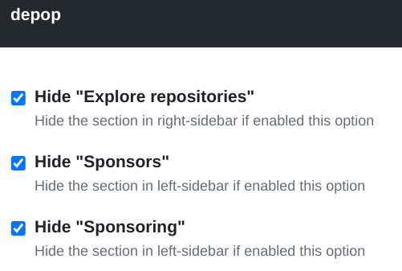

# depop

A Chrome Extension to hide stars, followers, watchers, sponsors, and other stats on GitHub

## Why?

I don't want my heart to be disturbed by the "±", especially during coding and research.

## Install

Choose one of the following options.

- [Chrome Web Store](https://chrome.google.com/webstore/detail/eyes-away-from-github-pop/bblbchjekobacogfioehogggccfagkmk)
- Download zip archive from [release page](https://github.com/kachick/depop/releases) and load it from `chrome://extensions/`.
- [Run build task](CONTRIBUTING.md) and load "./dist" folder as an [unpacked extension](https://developer.chrome.com/docs/extensions/mv3/getstarted/development-basics/#load-unpacked)

## Usage

By default, stars are hidden as much as possible.\
Some features can be hidden by enabling them on the [Options page](https://developer.chrome.com/docs/extensions/mv3/options/).

## Suppressable GitHub stats

- User
- Repository index
- Repository detail
- Pinned Repositories
- "Explore repositories" and/or the stars
- Sponsors
- Achievements # 0.0.0.13+
- Highlights # 0.0.0.13+

### Suppressable third party stats

- [GitHub Readme Stats](https://github.com/anuraghazra/github-readme-stats)

## Inspired

While digging into this feature, I noticed that
[rentzsch/unpopular](https://github.com/rentzsch/unpopular/tree/863963e26c1a758a53eb33747e0fec6f26ac130d)
exists.\
The way looks simple and reasonable to me, it just apply CSS without any
JavaScript.\
However, I started this project from below reasons.

- Applying CSS doesn't work with the current GitHub WebUI
- There is no activity in these 8 years
- It uses manifest version2.
  [Google will disable it with version3](https://developer.chrome.com/docs/extensions/mv3/mv2-sunset/).
- I want to focus on GitHub, would not consider around Twitter
